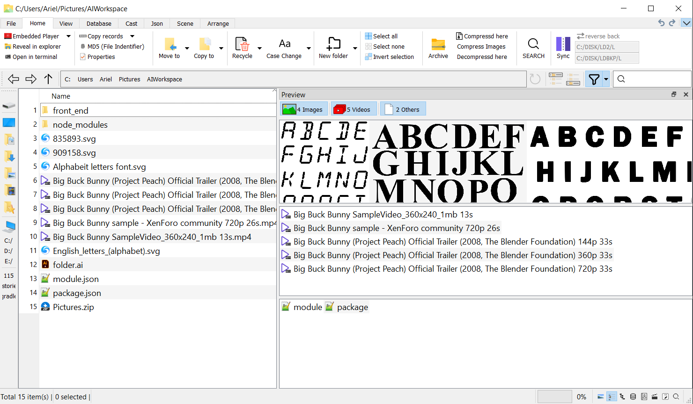

# FileExplorerReadyOnly

This application preview as follows:



## Coding Style About this project

variable of class data memeber:

1. class itself has ownership, start with "m_" or start with "m";
2. only transfer, no ownership, start with "m_" or start with "m" and endwith "_";

## Introduction

An File Explorer that can be used in windows and linux.

## New Feature
1. Logs Control

## Log Control
Interactive function:
1. Open latest log file
2. Open logs folder
3. Set log level(default: error), Attention:
    - This log level only control release edition.
4. Aging log file if size >= 20MiB

a log line example:
> `hh:mm:ss.zzz E functionName msg [fileName:fileNo]`

## Component

### Json Ribbon

**Submit**
Submit selected lines

**Sync cache/file system**
Sync Name Field from json file base name
reload json from disk
Export studios/cast to diction

**Case Control**
lower all words
capitalize first letter of each word

**file Operation**
Open json file
Reveal in explorer
rename json and related files

**Studio/Cast/Tags Operation**
Clear Studio fields
Clear Cast fields

Hint for Studio/Cast fields(from selected text)
Format Cast/Studio

Set Studio
Construct Studio/Json Fields

Set Cast
Add Cast
Rmv Cast

Set Tags
Add Tags
Rmv Tags


### ContentPanel
1 Table/Tree/List View:
1. abstract view double clicked


onActionAndViewNavigate
onActionAndViewNavigate

### NavigationAndAddressBar

3 Actions and 1 LineEdit:

1. UpTo
2. BackTo
3. ForwardTo
4. Search LineEdit Text changed
5. Search LineEdit Return Pressed


#### AddressELineEdit

1 Action and 1 LineEdit:
1. path action
2. return pressed

1. CustomTableView + QAbstractTableModel + QSortProxyModel + AdvanceSearchToolBar => SearchPane
#? merge QAbstractTableModel into QSortProxyModel? and discard the former
        adv: no more mapToSource, mapSelectionToSource
# ?? use or not Signal of QSortProxyModel filterCaseSensitivityChanged connect to startfilter
        a. when switch view to "search" 
                i. QAbstractTableModel 
                        1) setRootPathAndFilter(path, typeFilter)
                        2) call QDirIterator it(path, typeFilter, iteratorFlag)
        b. when searchLineEdit text changed
                i. QSortProxyModel
                        1) --- change m_text
                        2) --- startFilter(m_text and m_searchMode)
                                a) setFilterFixedString
                                b) setFilterRegularExpression
                                c) setFilterWildcard
                                d) setFilterCustomNameAndContent
        c. when typeToolButton nameFilterDisables triggered
                i. QSortProxyModel 
                        1) m_isNameFilterDisable
                        2) --- PostReturn() 
                                a) QAbstractTableModel
                                        i) m_disablesList.append
        d. when searchModeComboBox mode changed
                i. QSortProxyModel
                        1) --- change m_searchMode
                        2) --- startFilter(m_text and m_searchMode)
        e. searchCaseToolButton contents/name --- filterAcceptRow
                i. QSortProxyModel
                        1) --- change m_nameCaseSensitive, m_contentCaseSensitive
                        2) --- setIgnoreCase
                        3) --- startFilter(m_text and m_searchMode)
        f. GetSelection
                i. CustomTableView
                        1) selectionIndexes: mapToSource, mapSelectionToSource
2. CustomTableView + QSqlModel => PerformersPane, TorrPane
3. CustomTableView + QFileSystemModel => FileSystemPane
4. ListView + QFileSystemModel =>  FileSystemPane
5. TreeView + QFileSystemModel  => FileSystemPane

Extract AdvanceSearchToolBar out
level0: name/contentsLineEdit e.g., QSqlTableModel
level1: typeFilterToolButton FileSystemModel
level2: searchModeComboBox, CaseSensitiveToolButton, searchColumnComboBox, e.g., SortFilterMode


# Install Suggestion

## 1. How QTextEdit Show image from ByteArray

```cpp
if (not qzPath.toLower().endsWith(".qz")) {
  qWarning("Not a qz file");
  setWindowTitle(QString("ArchiveFilesPreview | [%1] not a qz file").arg(qzPath));
  return false;
}

ArchiveFiles af(qzPath, ArchiveFiles::ONLY_IMAGE);
static constexpr int K = 4;
// Todo, loading more button
QStringList paths;
QList<QByteArray> datas;
paths.reserve(K);
datas.reserve(K);

if (not af.ReadFirstKItemsOut(K, paths, datas)) {
  setWindowTitle(QString("ArchiveFilesPreview | [%1] read failed").arg(qzPath));
  return false;
}
setWindowTitle(QString("ArchiveFilesPreview | %1 item(s)").arg(paths.size()));

QTextDocument* textDocument = document();
for (int i = 0; i < paths.size(); ++i) {
  QUrl url{paths[i]};
  textDocument->addResource(QTextDocument::ImageResource, url, QVariant(datas[i]));
  QTextImageFormat imageFormat;
  imageFormat.setName(url.toString());

  QTextCursor cursor = textCursor();
  cursor.insertText(url.toString());
  cursor.insertText("\n");
  cursor.insertImage(imageFormat);
  cursor.insertText("\n");
}
```

## Demands:
### File Classify:

## Devoloping Settings for developer
```md
git update-index --assume-unchange FileExplorerReadOnly.pro.user
git update-index --assume-unchange FileExplorerTest.pro.user
git update-index --assume-unchange bin/logs_info.log

git update-index --no-assume-unchange FileExplorerReadOnly.pro.user
git update-index --no-assume-unchange FileExplorerTest.pro.user
git update-index --no-assume-unchange bin/logs_info.log
```


