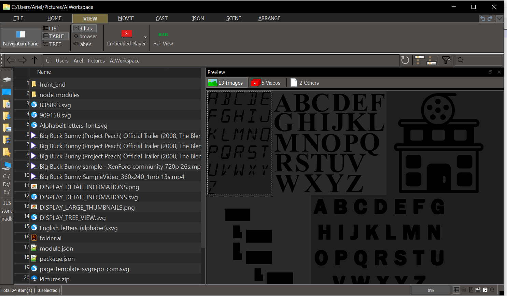
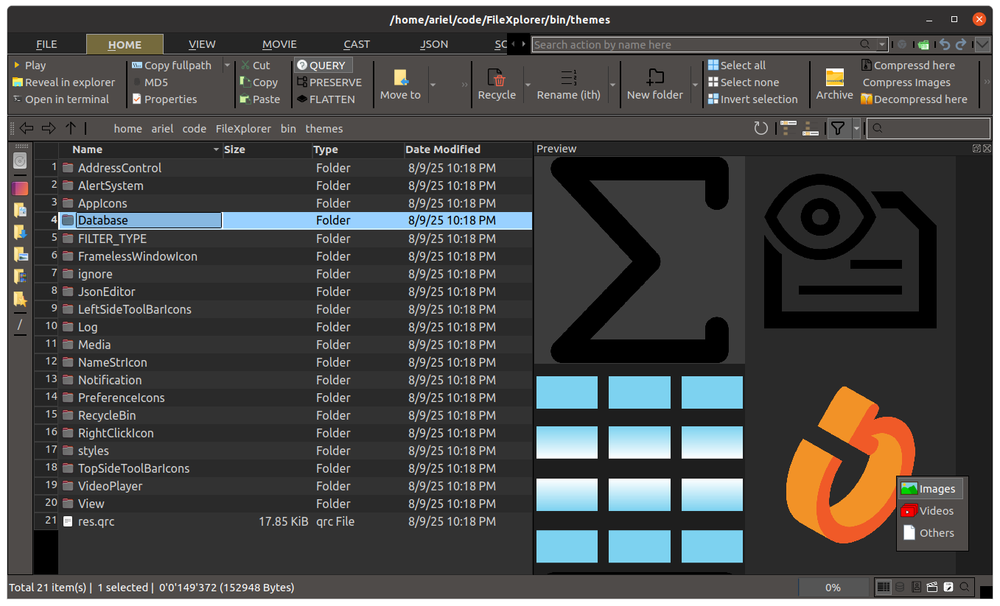
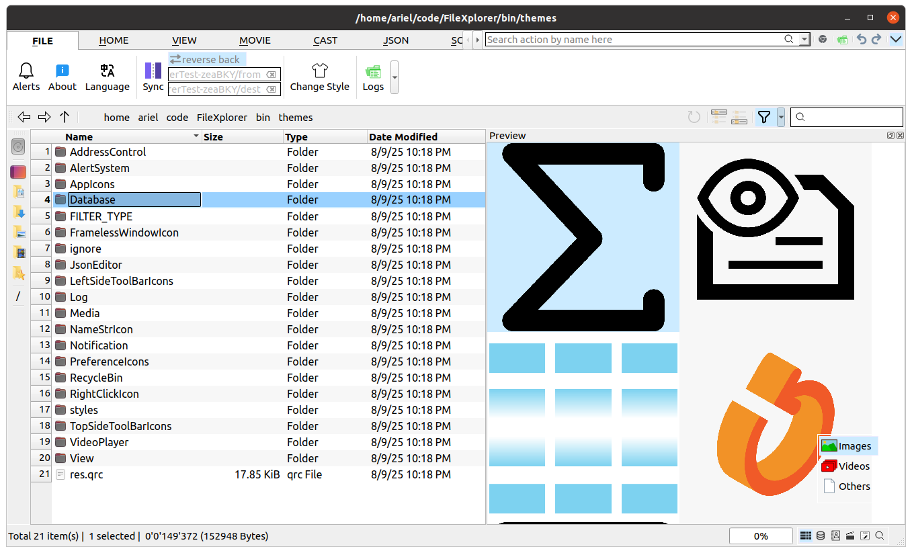
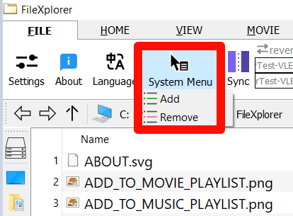
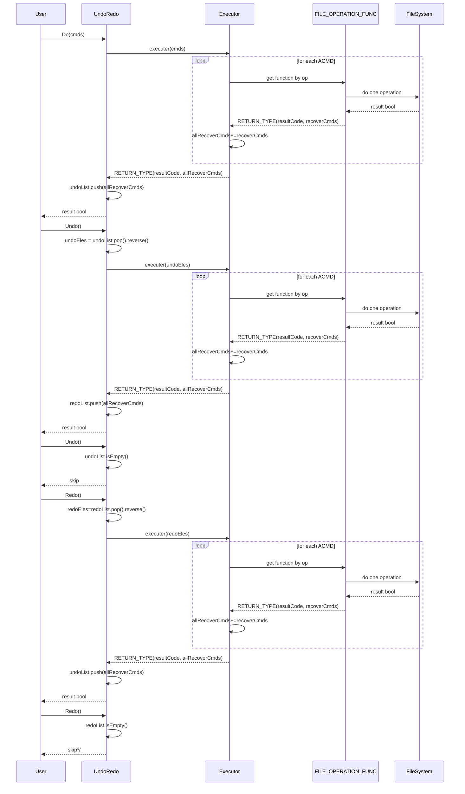

# FileXplorer - Ultimate File Management Suite

## Overview

FileXplorer is a cross-platform professional file management system engineered for photographers and videographers handling large-scale media files, offering advanced file operations across both Windows and Linux environments.




## Prerequisites:

### 1. FFmpeg/libav (Required for Video Duration Retrieval)
FFmpeg/libav is required to retrieve video duration information in the application. Below are the installation and configuration steps for Windows and Ubuntu systems:

#### Windows
Step 1: Download and Extract FFmpeg

1. Download the FFmpeg dynamic library package:
   - Visit the official FFmpeg download page: [https://ffmpeg.org/download.html](https://ffmpeg.org/download.html)
   - Under "Windows EXE Files", select `Windows builds from gyan.dev`
   - Download the package named `ffmpeg-7.1.1-full_build-shared.7z` (approx. 44.4 MiB; newer compatible versions are also acceptable)
2. Extract the downloaded `.7z` file to a custom directory (e.g., `C:/home/ffmpeg`)

Step 2: Verify FFmpeg Path Configuration

Ensure the path containing `ffmpeg.exe` (e.g., `C:/home/ffmpeg/bin`) is added to the system `PATH` variable.  
One can add it and verify it via the Command Prompt(Run as administrator):
```cmd
setx PATH "C:/home/ffmpeg/bin;%PATH%" /M
echo %PATH%|findstr -i "ffmpeg"
```

Step 3: Quit Command Prompt

#### Ubuntu

Install FFmpeg Dependencies

Install the required FFmpeg development libraries and binaries via apt:

```sh
sudo apt install libavformat-dev libavcodec-dev libavutil-dev libswscale-dev
sudo apt install ffmpeg
ffmpeg -version
```

#### Verify FFmpeg Integration
Run the following C++ code to confirm FFmpeg is properly configured. The output should show FFmpeg version: 3999588 (version number may vary by build):
```cpp
#include <QDebug>
extern "C" {
#include <libavformat/avformat.h>
}

void testFFmpeg() {
    avformat_network_init();
    qDebug() << "FFmpeg version:" << avformat_version();
}
```

### 2. OpenSSL (Required when PASSVAULT_ENABLED=ON)
OpenSSL is required to support encryption and decryption functionality for the password book feature. Below are the installation steps for Windows and Ubuntu systems:

#### Windows
1. **Download OpenSSL Installer**
   Visit the official Win32/Win64 OpenSSL download page:  
   https://slproweb.com/products/Win32OpenSSL.html
   
   - Select the `Win64 OpenSSL v3.5.1` package (**non-Light version**)
   - Download the installer file: `Win64OpenSSL-3_5_1.msi` (approx. 281 MiB)

2. **Install OpenSSL**
   - Run the downloaded `.msi` installer
   - Use the default installation path: `C:\Program Files\OpenSSL-Win64` (recommended for easy management)
   - During installation, select the option:  
     `Copy OpenSSL DLLs to → The OpenSSL binaries (/bin) directory`
   - Complete the installation wizard with default settings

3. **Verify Installation**
   Open Command Prompt (CMD) and execute the following commands to confirm successful installation:
   ```cmd
   cd "C:\Program Files\OpenSSL-Win64\bin"
   openssl version
   ```

#### Ubuntu
Install OpenSSL via the terminal with the following commands:
```sh
sudo apt install -y openssl libssl-dev
openssl version
```

## Core Features

1. File/Folder Preview & ‌Sidebar Navigation‌

        (1). Enables categorized preview of folder contents without opening them;

        (2). Simply select any folder to view its items in the right-side preview pane;

        (3). Configurable file type filters and customizable default display order

        (4). Supports drag-and-drop bookmarking for multiple folders simultaneously;

        (5). Provides both automatic (alphabetical/path-based) and manual sorting options;

        (6). All bookmark configurations persist to local settings file;

2. File Batch Renaming Operations (with Preview Window)

        (1). Basic string operations (add/delete/replace) with regex support (e.g. "wifi" → "Wi-Fi");

        (2). Case conversion: UPPERCASE/lowercase/Title Case/Sentence case/tOgGlE cAsE;

        (3). Columnize strings by delimiter and reorder segments (e.g. "Marvel - S01E02 - 2012" → "Marvel - 2012 - S01E02");

        (4). Sequential numbering with customizable patterns/start values (e.g. "Trip - Scenery - %d", start=3);

3. Multi-path Synchronization
Automatically mirrors operations from source folder to designated mirror folders;

4. Deep Search Functionality
File/folder search by: filename, content, or combined criteria;

5. Accessibility
Fuzzy matching of action names in dropdowns to bypass hierarchical menu navigation;

6. Advanced Features:

        (1)‌. Image Deduplication‌: Preview detected duplicates for manual confirmation before deletion;

        (2)‌. ‌Video Deduplication‌: Compares filename, size, duration, and partial hash (first XX MB);

        (3)‌. ‌‌One-click Categorization‌: Group related images/videos/documents into folders with undo support;

        (4)‌. ‌‌Video Metadata Export‌: Saves to MOVIES table (filename/size/duration/MD5) with VIDEOS view for management;

        (5)‌. ‌‌Audit Trail‌: Manual/scheduled updates to MOVIES table after file changes, logging modification counts;

        (6)‌. ‌‌File Comparison‌: Quick MD5/size checks for identity verification

7. UI Themes
Light/Dark theme support with automatic time-based switching or manual lock;




## Coding Style

variable of class data memeber:

1. class itself has ownership, start with "m_" or start with "m";
2. only transfer, no ownership, start with "m_" or start with "m" and endwith "_";

## Devoloping Settings
we suggest you to do following setting in git bash
```md
git update-index --assume-unchange FileXplorer.pro.user
git update-index --assume-unchange FileXplorerTest.pro.user
git update-index --assume-unchange bin/logs_info.log

git update-index --no-assume-unchange FileXplorer.pro.user
git update-index --no-assume-unchange FileXplorerTest.pro.user
git update-index --no-assume-unchange bin/logs_info.log
```

```md
git filter-branch --force --index-filter   "git rm --cached --ignore-unmatch bin/AKA_PERFORMERS.txt"   --prune-empty --tag-name-filter cat -- --all  
rm -rf .git/refs/original/
git reflog expire --expire=now --all
git gc --prune=now --aggressive

git remote set-url git@github.com:CostaHector/FileXplorer.git
git remote -v
git remote remove origin
git remote add origin git@github.com:CostaHector/FileXplorer.git
git push -u origin fileXplor:master -f
git remote add origin git@github.com:CostaHector/FileXplorer.git
```

## New Feature
1. Logs Control

### Log Control
Interactive function:
1. Open latest log file
2. Open logs folder
3. Set log level(default: error), Attention:
    - This log level only control release edition.
4. Aging log file if size >= 20MiB

a log line example:
> `hh:mm:ss.zzz E functionName msg [fileName:fileNo]`

## Add this application to file system context menu

### For windows user

Precondition: add path that contains `[Qt5Core.dll]` says "C:\Qt\5.15.2\mingw81_64\bin" to system variable path.

Way1: (Recommend)



```md
In "File" Tab Widget;

Click "System Menu/Add";

In the popup UAC Window click allow this app to make changes;

```

Way2: 
```md
Open regedit;

Into following path `Computer\HKEY_CLASSES_ROOT\Directory\Background\shell\`;

New a key "FileXplorer" under "shell";

New a key "command" under "FileXplorer";

Modify command (Default) value data to following string;

`"C:\home\aria\code\FileXplorer\build\Desktop_Qt_5_15_2_MinGW_64_bit-Release\FileXplorer.exe" "%V"`
```

### for Ubuntu user
using fma-config-tool
```sh
sudo apt install nautilus-actions
fma-config-tool
```

in menu bar "FileManager Action Configuration Tool", uncheck following action

> Preference > Runtime Preference > Nautilus menu layout > Create a root "FileManager-Actions" menu

Define a new action

1. set Action tab below:

    check the action display item in selection context menu 

    check the action display item in location context menu 

    icon: /home/ariel/code/FileXplorer/bin/themes/AppIcons/FOLDER_OF_PICTURES.png

2. set Commands tab below:

    Path: /home/ariel/code/FileXplorer/build/Desktop_Qt_5_15_2_GCC_64bit-Release/FileXplorer

    Parameter: "%d"

save the items tree

## Coverage report in linux
```bash
cmake --build /home/ariel/code/FileXplorer/build/FileXplorerTest_Desktop_Qt_5_15_2_GCC_64bit-Debug --target all
cd /home/ariel/code/FileXplorer/build/FileXplorerTest_Desktop_Qt_5_15_2_GCC_64bit-Debug;/usr/bin/lcov --capture --directory . --output-file coverage.info --exclude "/home/ariel/Qt/*" --exclude "/usr/include/*" --exclude "/usr/local/include/*" --exclude "*/TestCase/*" --exclude "*/unittest/*"        --exclude "*/build/*"
cd /home/ariel/code/FileXplorer/build/FileXplorerTest_Desktop_Qt_5_15_2_GCC_64bit-Debug;genhtml coverage.info --output-directory coverage_report
cd /home/ariel/code/FileXplorer


# if some file was removed. remove its related files like {*.gcda, *.gcno, *.o, *.html}
find ./ -name "RemovedFileName*" -print
find ./ -name "RemovedFileName*" -delete
```

## Update translate files is needed

```bash
cd path_to_project
# windows
C:/Qt/5.15.2/mingw81_64/bin/lupdate . -no-obsolete -recursive -locations relative -ts ./resources/Translate/FileXplorer_zh_CN.ts
C:/Qt/5.15.2/mingw81_64/bin/linguist ./resources/Translate/FileXplorer_zh_CN.ts
C:/Qt/5.15.2/mingw81_64/bin/lrelease ./resources/Translate/FileXplorer_zh_CN.ts -qm ./resources/Translate/FileXplorer_zh_CN.qm
# linux
/home/ariel/Qt/5.15.2/gcc_64/bin/lupdate . -no-obsolete -recursive -locations relative -ts ./resources/Translate/FileXplorer_zh_CN.ts
/home/ariel/Qt/5.15.2/gcc_64/bin/linguist ./resources/Translate/FileXplorer_zh_CN.ts
/home/ariel/Qt/5.15.2/gcc_64/bin/lrelease ./resources/Translate/FileXplorer_zh_CN.ts -qm ./resources/Translate/FileXplorer_zh_CN.qm
```

## Font type and size
Copy file "msyh.ttc" "msyhbd.ttc" from `C:\Windows\Fonts`.

```bash
sudo mkdir -p /usr/share/fonts/microsoft
sudo cp msyh.ttc msyhbd.ttc /usr/share/fonts/microsoft/
sudo fc-cache -fv
```

## sqlite db browser recommend
sudo apt update
sudo apt install sqlitebrowser

## Snippets
Edir/Preference/TextEditor/Snippets
Add and fill contents below

`Trigger`: StdTestCase

`Trigger Variant`: widget

```cpp
#include <QtTest/QtTest>
#include "PlainTestSuite.h"
#include "OnScopeExit.h"
#include <QTestEventList>
#include <QSignalSpy>

#include "Logger.h"
#include "MemoryKey.h"
#include "Configuration.h"
#include "BeginToExposePrivateMember.h"
#include "$ClassName$.h"
#include "EndToExposePrivateMember.h"

#include <QDir>
#include <QDirIterator>

Q_DECLARE_METATYPE(QDir::Filters)
Q_DECLARE_METATYPE(QDirIterator::IteratorFlag)

class $ClassName$Test : public PlainTestSuite {
  Q_OBJECT
 public:
 private slots:
  void initTestCase() {
    qRegisterMetaType<QDir::Filters>("QDir::Filters");
    qRegisterMetaType<QDirIterator::IteratorFlag>("QDirIterator::IteratorFlag");
    Configuration().clear();
  }

  void cleanupTestCase() { Configuration().clear(); }

  void test_1() {
    $$
  }
};

#include "$ClassName$Test.moc"
REGISTER_TEST($ClassName$Test, false)
```


## Testcase
### Table 1.0 Expected Behavior of rename Functions
```cpp
RETURN_TYPE rename(const QString& srcPath, const QString& oldCompleteName, const QString& newCompleteName);
```
| srcPath | oldCompleteName | newCompleteName | exist items in srcPath | result |
|---------|-----------------|-----------------|---------------------------------------------------|--------|
| home | a | A | {a} | OK |
| home | a | A | {a, A} | In windows platform no need consider this one as system may prevent two items(Only differ in case) place/create/moved in one folder;<br/>Linux return DST_FILE_OR_PATH_ALREADY_EXIST |
| home | a | a | {a} | SKIP |
| home | a | b | {a} | OK |
| home | a | b | {a,b} | windows/linux return DST_FILE_OR_PATH_ALREADY_EXIST|
| home | a | B | {a,B} | windows/linux return DST_FILE_OR_PATH_ALREADY_EXIST|
| home | a | b | {a,B} | windows return DST_FILE_OR_PATH_ALREADY_EXIST;<br/>Linux return OK|
| home | a | B | {a,b} | windows return DST_FILE_OR_PATH_ALREADY_EXIST;<br/>Linux return OK|

### Table 1.1 Expected Behavior of mv Functions
```cpp
RETURN_TYPE mv(const QString& srcPath, const QString& relToItem, const QString& dstPath);
```
| srcPath | relToItem | dstPath | exist items in dstPath | result |
|---------|-----------|---------|---------------------------------------------------|--------|
| home | any1 | home | {any1} | OK, SKIP |
| home | any1 | HOME | {any1} | OK, SKIP. It is not recommend to create two folder only differ in name case in Linux platform. |
| home | a | bin | {} | OK |
| home | a | bin | {a} | windows/linux return DST_FILE_OR_PATH_ALREADY_EXIST |
| home | a | bin | {A} | windows return DST_FILE_OR_PATH_ALREADY_EXIST;<br/>linux return OK |
| home | path/to/a | bin | {} | OK |
| home | path/to/a | bin | {path/to} | OK |
| home | path/to/a | bin | {path/to/a} | windows/linux return DST_FILE_OR_PATH_ALREADY_EXIST |
| home | path/to/a.txt | bin | {} | OK |

### Table 1.2 Expected Behavior of rmpath Functions
```cpp
RETURN_TYPE rmpath(const QString& pre, const QString& dirPath);
```
| srcPath | relToItem | exist items in srcPath | result |
|---------|-----------|---------------------------------------------------|--------|
| home | a/a1 | {a/a1, a/a1/a2.txt} | CANNOT_REMOVE_DIR |
| home | a/a1 | {a/a1} | OK |
| home | a | {a/a.txt} | CANNOT_REMOVE_DIR |
| home | a | {a} | OK |

### Table 1.3 Expected Behavior of mkpath Functions
```cpp
RETURN_TYPE mkpath(const QString& pre, const QString& dirPath);
```
| srcPath | relToItem | exist items in srcPath | result |
|---------|-----------|---------------------------------------------------|--------|
| home | a/a1 | srcPath not exist | DST_DIR_INEXIST |
| home | a/a1 | {} | OK |
| home | a/a1 | {a} | OK |
| home | a/a1 | {a/a1} | OK |
| home | a | {} | OK |

### Table 1.4 Expected Behavior of RedundantImageFinder class
| imgs in benchmarkPath<br/>name(contents) | imgs in pathToFindRedundent<br/>name(contents) | also find empty  | result |
|---------|-----------|---------------------------------------------------|--------|
| {a.jpg("123"),<br/>aDuplicate.png("123"),<br/>b.png("456")} | {aRedun.jpg("123"),<br/>bRedun.png("456"),<br/>cEmpty.webp("")} | true | {aRedun.jpg,<br/>bRedun.png,<br/>cEmpty.webp} |
| {a.jpg("123"),<br/>aDuplicate.png("123"),<br/>b.png("456")} | {aRedun.jpg("123"),<br/>bRedun.png("456"),<br/>cEmpty.webp("")} | false | {aRedun.jpg,<br/>bRedun.png} |


### Table 1.5 Expected Behavior of function FileOperation::executer
```cpp
RETURN_TYPE executer(const BATCH_COMMAND_LIST_TYPE& aBatch);
```

| `QList<ACMD>` | precondition | `bFastFail` | `ErrorCode` | `AllRecoverCmds` |
|-------------|--------------|-----------|--------|-------|
|ACMD[RNAME,home,filea,fileb];<br/>ACMD[RNAME,home,fileb,filec];| exists:  {home/filea} | not matter | OK | ACMD[RNAME,home,fileb,filea];<br/>ACMD[RNAME,home,filec,fileb];|
|ACMD[RNAME,home,filea,nfilea];<br/>ACMD[RNAME,home,fileb,nfileb];| exists:  {home/fileb} | true | SRC_INEXIST | empty|
|ACMD[RNAME,home,filea,nfilea];<br/>ACMD[RNAME,home,fileb,nfileb];| exists:  {home/fileb} | true | EXEC_PARTIAL_FAILED | ACMD[RNAME,home,nfileb,fileb];|


### Undo/Redo/Executor Sequence Diagram

```mermaid
sequenceDiagram
    participant User
    participant UndoRedo
    participant Executor
    participant FILE_OPERATION_FUNC
    participant FileSystem

    User->>UndoRedo: Do(cmds)
    UndoRedo->>Executor: executer(cmds)
    loop for each ACMD
        Executor->>FILE_OPERATION_FUNC: get function by op
        FILE_OPERATION_FUNC->>FileSystem: do one operation
        FileSystem-->>FILE_OPERATION_FUNC: result bool
        FILE_OPERATION_FUNC-->>Executor: RETURN_TYPE(resultCode, recoverCmds)
        Executor->>Executor: allRecoverCmds+=recoverCmds
    end

    Executor-->>UndoRedo: RETURN_TYPE(resultCode, allRecoverCmds)
    UndoRedo->>UndoRedo: undoList.push(allRecoverCmds)
    UndoRedo-->>User: result bool

    User->>UndoRedo: Undo()
    UndoRedo->>UndoRedo: undoEles = undoList.pop().reverse()
    UndoRedo->>Executor: executer(undoEles)
    loop for each ACMD
        Executor->>FILE_OPERATION_FUNC: get function by op
        FILE_OPERATION_FUNC->>FileSystem: do one operation
        FileSystem-->>FILE_OPERATION_FUNC: result bool
        FILE_OPERATION_FUNC-->>Executor: RETURN_TYPE(resultCode, recoverCmds)
        Executor->>Executor: allRecoverCmds+=recoverCmds
    end

    Executor-->>UndoRedo: RETURN_TYPE(resultCode, allRecoverCmds)
    UndoRedo->>UndoRedo: redoList.push(allRecoverCmds)
    UndoRedo-->>User: result bool

    User->>UndoRedo: Undo()
    UndoRedo->>UndoRedo: undoList.isEmpty()
    UndoRedo-->>User: skip

    User->>UndoRedo: Redo()
    UndoRedo->>UndoRedo: redoEles=redoList.pop().reverse()
    UndoRedo->>Executor: executer(redoEles)
    loop for each ACMD
        Executor->>FILE_OPERATION_FUNC: get function by op
        FILE_OPERATION_FUNC->>FileSystem: do one operation
        FileSystem-->>FILE_OPERATION_FUNC: result bool
        FILE_OPERATION_FUNC-->>Executor: RETURN_TYPE(resultCode, recoverCmds)
        Executor->>Executor: allRecoverCmds+=recoverCmds
    end

    Executor-->>UndoRedo: RETURN_TYPE(resultCode, allRecoverCmds)
    UndoRedo->>UndoRedo: undoList.push(allRecoverCmds)
    UndoRedo-->>User: result bool
    User->>UndoRedo: Redo()
    UndoRedo->>UndoRedo: redoList.isEmpty()
    UndoRedo-->>User: skip*/
```


### Table 1.6 Notificator Balloon Function Test Results

| Function Point | Test Case | Test Result |
|----------------|-----------|-------------|
| One-shot timer timeout triggers close | `timeoutLenGT0_AutoHideTimerActive_ok` | ✅ PASS |
| Progress bar completion triggers close | `progress100_drive_FreeMe_ok` | ✅ PASS |
| Finished signal triggers close | `finished_signal_drive_FreeMe_ok` | ✅ PASS |
| Multiple notifications layout from top to bottom (with Y-coordinate wrapping) | `cards_tile_from_top_to_bottom_wrapped_ok` | ✅ PASS |
| Multiple notifications layout from bottom to top (with Y-coordinate wrapping) | `cards_tile_from_bottom_to_top_wrapped_ok` | ✅ PASS |

## Acknowledgments

The database-related icons used in this application are sourced from the [DB Browser for SQLite](https://github.com/sqlitebrowser/sqlitebrowser) project. These icons are licensed under the [GNU General Public License v3](https://www.gnu.org/licenses/gpl-3.0.html) (GPLv3).

We extend our sincere thanks to the DB Browser for SQLite development team and contributor community for their excellent work.
