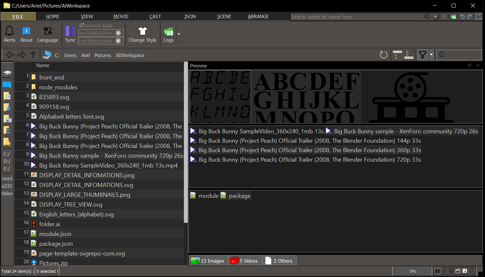
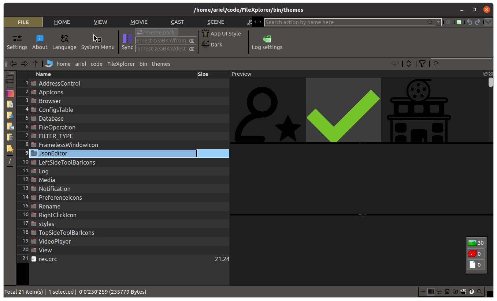
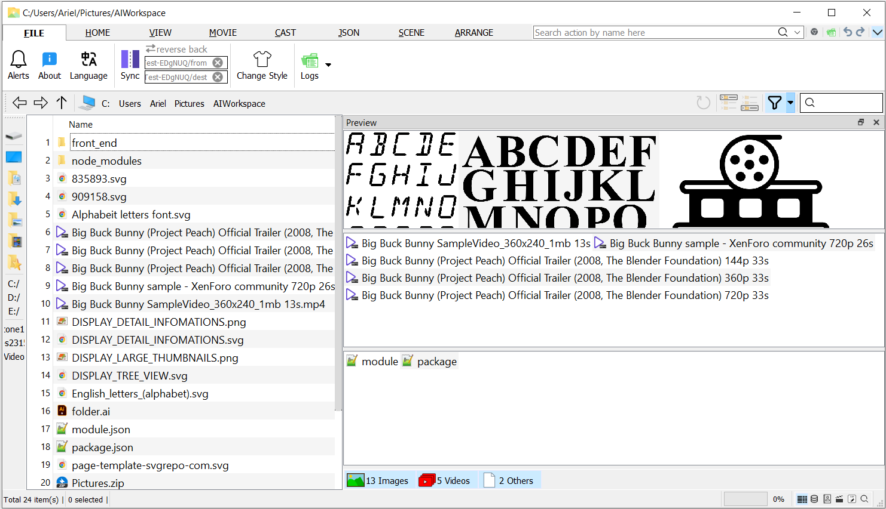
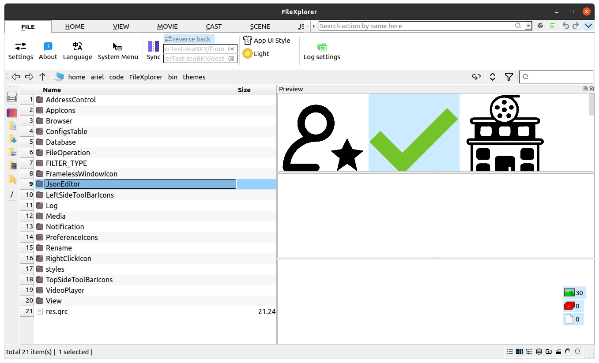

# FileXplorer - Ultimate File Management Suite

## Overview

FileXplorer is a cross-platform professional file management system engineered for photographers and videographers handling large-scale media files, offering advanced file operations across both Windows and Linux environments.




## Core Features

1. File/Folder Preview & ‌Sidebar Navigation‌

        (1). Enables categorized preview of folder contents without opening them;

        (2). Simply select any folder to view its items in the right-side preview pane;

        (3). Configurable file type filters and customizable default display order

        (4). Supports drag-and-drop bookmarking for multiple folders simultaneously;

        (5). Provides both automatic (alphabetical/path-based) and manual sorting options;

        (6). All bookmark configurations persist to local settings file;

2. File Batch Renaming Operations (with Preview Window)

        (1). Basic string operations (add/delete/replace) with regex support (e.g. "wifi" → "Wi-Fi");

        (2). Case conversion: UPPERCASE/lowercase/Title Case/Sentence case/tOgGlE cAsE;

        (3). Columnize strings by delimiter and reorder segments (e.g. "Marvel - S01E02 - 2012" → "Marvel - 2012 - S01E02");

        (4). Sequential numbering with customizable patterns/start values (e.g. "Trip - Scenery - %d", start=3);

3. Multi-path Synchronization
Automatically mirrors operations from source folder to designated mirror folders;

4. Deep Search Functionality
File/folder search by: filename, content, or combined criteria;

5. Accessibility
Fuzzy matching of action names in dropdowns to bypass hierarchical menu navigation;

6. Advanced Features:

        (1)‌. Image Deduplication‌: Preview detected duplicates for manual confirmation before deletion;

        (2)‌. ‌Video Deduplication‌: Compares filename, size, duration, and partial hash (first XX MB);

        (3)‌. ‌‌One-click Categorization‌: Group related images/videos/documents into folders with undo support;

        (4)‌. ‌‌Video Metadata Export‌: Saves to MOVIES table (filename/size/duration/MD5) with VIDEOS view for management;

        (5)‌. ‌‌Audit Trail‌: Manual/scheduled updates to MOVIES table after file changes, logging modification counts;

        (6)‌. ‌‌File Comparison‌: Quick MD5/size checks for identity verification

7. UI Themes
Light/Dark theme support with automatic time-based switching or manual lock;




## Coding Style

variable of class data memeber:

1. class itself has ownership, start with "m_" or start with "m";
2. only transfer, no ownership, start with "m_" or start with "m" and endwith "_";

## Devoloping Settings
we suggest you to do following setting in git bash
```md
git update-index --assume-unchange FileXplorer.pro.user
git update-index --assume-unchange FileXplorerTest.pro.user
git update-index --assume-unchange bin/logs_info.log
git update-index --assume-unchange bin/TERMINAL_OPEN_BATCH_FILE_PATH.bat

git update-index --no-assume-unchange FileXplorer.pro.user
git update-index --no-assume-unchange FileXplorerTest.pro.user
git update-index --no-assume-unchange bin/logs_info.log
```

```md
git filter-branch --force --index-filter   "git rm --cached --ignore-unmatch bin/AKA_PERFORMERS.txt"   --prune-empty --tag-name-filter cat -- --all  
rm -rf .git/refs/original/
git reflog expire --expire=now --all
git gc --prune=now --aggressive

git remote set-url git@github.com:CostaHector/FileXplorer.git
git remote -v
git remote remove origin
git remote add origin git@github.com:CostaHector/FileXplorer.git
git push -u origin fileXplor:master -f
git remote add origin git@github.com:CostaHector/FileXplorer.git
```

## New Feature
1. Logs Control

### Log Control
Interactive function:
1. Open latest log file
2. Open logs folder
3. Set log level(default: error), Attention:
    - This log level only control release edition.
4. Aging log file if size >= 20MiB

a log line example:
> `hh:mm:ss.zzz E functionName msg [fileName:fileNo]`

## get video duration using FFmpeg/libav
### in windows:
step1: Download dynamic library `ffmpeg-7.1.1-full_build-shared.7z` and extract to a ${path}. then add this "${path}/bin" to system environment path.

step2: Here we assume path added to system variable is "C:/home/ffmpeg/bin", i.e. SET(path "C:/home/ffmpeg")

step3: add following snippet in .pro file
```pro
win32 {
    # FFmpeg headers path
    INCLUDEPATH += "C:/home/ffmpeg/include"
    # FFmpeg libs path
    LIBS += -L"C:/home/ffmpeg/lib" -lavformat -lavcodec  -lavutil -lswscale -lws2_32 -lsecur32
}
```

step3: add following snippet in .pro file for CMakelists.txt
```cmake
set(ffmpegpath "C:/home/ffmpeg")
target_include_directories(ThumbnailsGetterFFmpeg PRIVATE "${ffmpegpath}/include")
target_link_libraries(ThumbnailsGetterFFmpeg PRIVATE ws2_32 Qt5::Core
	"${ffmpegpath}/lib/avformat.lib"
	"${ffmpegpath}/lib/avcodec.lib"
	"${ffmpegpath}/lib/avutil.lib"
	"${ffmpegpath}/lib/swscale.lib")
```

step4: run the following code snippet. It should says "FFmpeg version: 3999588"
```cpp
#include <QDebug>
extern "C"{
#include <libavformat/avformat.h>
}
void testFFmpeg() {
    avformat_network_init();
    qDebug() << "FFmpeg version:" << avformat_version();
}
```

### in ubuntu

step1: install following items. and test if it was intalled succeed
```sh
sudo apt install libavformat-dev libavcodec-dev libavutil-dev libswscale-dev
sudo apt install ffmpeg
ffmpeg
```

step3: add following snippet in .pro file
```
linux {
    LIBS += -lavformat -lavcodec -lavutil -lswscale
}
```

## Add this application to file system context menu

### For windows user

Way1: (Recommend)


```md
In "File" Tab Widget;

Click "System Menu/Add";

In the popup UAC Window click allow this app to make changes;
```

Way2: 
```md
Open regedit;

Into following path `Computer\HKEY_CLASSES_ROOT\Directory\Background\shell\`;

New a key "FileXplorer" under "shell";

New a key "command" under "FileXplorer";

Modify command (Default) value data to following string;

`"C:\home\aria\code\FileXplorer\build\Desktop_Qt_5_15_2_MinGW_64_bit-Release\FileXplorer.exe" "%V"`
```

And don't forget to add "C:\Qt\5.15.2\mingw81_64\bin" to system environment path

### for Ubuntu user
using fma-config-tool
```sh
sudo apt install nautilus-actions
fma-config-tool
```

in menu bar "FileManager Action Configuration Tool", uncheck following action

> Preference > Runtime Preference > Nautilus menu layout > Create a root "FileManager-Actions" menu

Define a new action

1. set Action tab below:

    check the action display item in selection context menu 

    check the action display item in location context menu 

    icon: /home/ariel/code/FileXplorer/bin/themes/AppIcons/FOLDER_OF_PICTURES.png

2. set Commands tab below:

    Path: /home/ariel/code/FileXplorer/build/Desktop_Qt_5_15_2_GCC_64bit-Release/FileXplorer

    Parameter: "%d"

save the items tree


## Testcase
### Table 1.0 Expected Behavior of rename Functions
```cpp
RETURN_TYPE rename(const QString& srcPath, const QString& oldCompleteName, const QString& newCompleteName);
```
| srcPath | oldCompleteName | newCompleteName | exist items in srcPath | result |
|---------|-----------------|-----------------|---------------------------------------------------|--------|
| home | a | A | {a} | OK |
| home | a | A | {a, A} | In windows platform no need consider this one as system may prevent two items(Only differ in case) place/create/moved in one folder;<br/>Linux return DST_FILE_OR_PATH_ALREADY_EXIST |
| home | a | a | {a} | SKIP |
| home | a | b | {a} | OK |
| home | a | b | {a,b} | windows/linux return DST_FILE_OR_PATH_ALREADY_EXIST|
| home | a | B | {a,B} | windows/linux return DST_FILE_OR_PATH_ALREADY_EXIST|
| home | a | b | {a,B} | windows return DST_FILE_OR_PATH_ALREADY_EXIST;<br/>Linux return OK|
| home | a | B | {a,b} | windows return DST_FILE_OR_PATH_ALREADY_EXIST;<br/>Linux return OK|

### Table 1.1 Expected Behavior of mv Functions
```cpp
RETURN_TYPE mv(const QString& srcPath, const QString& relToItem, const QString& dstPath);
```
| srcPath | relToItem | dstPath | exist items in dstPath | result |
|---------|-----------|---------|---------------------------------------------------|--------|
| home | any1 | home | {any1} | OK, SKIP |
| home | any1 | HOME | {any1} | OK, SKIP. It is not recommend to create two folder only differ in name case in Linux platform. |
| home | a | bin | {} | OK |
| home | a | bin | {a} | windows/linux return DST_FILE_OR_PATH_ALREADY_EXIST |
| home | a | bin | {A} | windows return DST_FILE_OR_PATH_ALREADY_EXIST;<br/>linux return OK |
| home | path/to/a | bin | {} | OK |
| home | path/to/a | bin | {path/to} | OK |
| home | path/to/a | bin | {path/to/a} | windows/linux return DST_FILE_OR_PATH_ALREADY_EXIST |
| home | path/to/a.txt | bin | {} | OK |

### Table 1.2 Expected Behavior of rmpath Functions
```cpp
RETURN_TYPE rmpath(const QString& pre, const QString& dirPath);
```
| srcPath | relToItem | exist items in srcPath | result |
|---------|-----------|---------------------------------------------------|--------|
| home | a/a1 | {a/a1, a/a1/a2.txt} | CANNOT_REMOVE_DIR |
| home | a/a1 | {a/a1} | OK |
| home | a | {a/a.txt} | CANNOT_REMOVE_DIR |
| home | a | {a} | OK |

### Table 1.3 Expected Behavior of mkpath Functions
```cpp
RETURN_TYPE mkpath(const QString& pre, const QString& dirPath);
```
| srcPath | relToItem | exist items in srcPath | result |
|---------|-----------|---------------------------------------------------|--------|
| home | a/a1 | srcPath not exist | DST_DIR_INEXIST |
| home | a/a1 | {} | OK |
| home | a/a1 | {a} | OK |
| home | a/a1 | {a/a1} | OK |
| home | a | {} | OK |

### Table 1.4 Expected Behavior of RedundantImageFinder class
| imgs in benchmarkPath<br/>name(contents) | imgs in pathToFindRedundent<br/>name(contents) | also find empty  | result |
|---------|-----------|---------------------------------------------------|--------|
| {a.jpg("123"),<br/>aDuplicate.png("123"),<br/>b.png("456")} | {aRedun.jpg("123"),<br/>bRedun.png("456"),<br/>cEmpty.webp("")} | true | {aRedun.jpg,<br/>bRedun.png,<br/>cEmpty.webp} |
| {a.jpg("123"),<br/>aDuplicate.png("123"),<br/>b.png("456")} | {aRedun.jpg("123"),<br/>bRedun.png("456"),<br/>cEmpty.webp("")} | false | {aRedun.jpg,<br/>bRedun.png} |


### Table 1.5 Expected Behavior of function FileOperation::executer
```cpp
RETURN_TYPE executer(const BATCH_COMMAND_LIST_TYPE& aBatch);
```

| `QList<ACMD>` | precondition | `bFastFail` | `ErrorCode` | `AllRecoverCmds` |
|-------------|--------------|-----------|--------|-------|
|ACMD[RNAME,home,filea,fileb];<br/>ACMD[RNAME,home,fileb,filec];| exists:  {home/filea} | not matter | OK | ACMD[RNAME,home,fileb,filea];<br/>ACMD[RNAME,home,filec,fileb];|
|ACMD[RNAME,home,filea,nfilea];<br/>ACMD[RNAME,home,fileb,nfileb];| exists:  {home/fileb} | true | SRC_INEXIST | empty|
|ACMD[RNAME,home,filea,nfilea];<br/>ACMD[RNAME,home,fileb,nfileb];| exists:  {home/fileb} | true | EXEC_PARTIAL_FAILED | ACMD[RNAME,home,nfileb,fileb];|


### Undo/Redo/Executor Sequence Diagram


### Table 1.6 Notificator Balloon Function Test Results

| Function Point | Test Case | Test Result |
|----------------|-----------|-------------|
| One-shot timer timeout triggers close | `timeoutLenGT0_AutoHideTimerActive_ok` | ✅ PASS |
| Progress bar completion triggers close | `progress100_drive_FreeMe_ok` | ✅ PASS |
| Finished signal triggers close | `finished_signal_drive_FreeMe_ok` | ✅ PASS |
| Multiple notifications layout from top to bottom (with Y-coordinate wrapping) | `cards_tile_from_top_to_bottom_wrapped_ok` | ✅ PASS |
| Multiple notifications layout from bottom to top (with Y-coordinate wrapping) | `cards_tile_from_bottom_to_top_wrapped_ok` | ✅ PASS |
