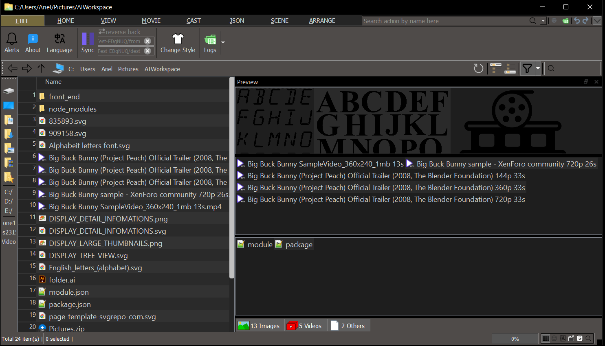
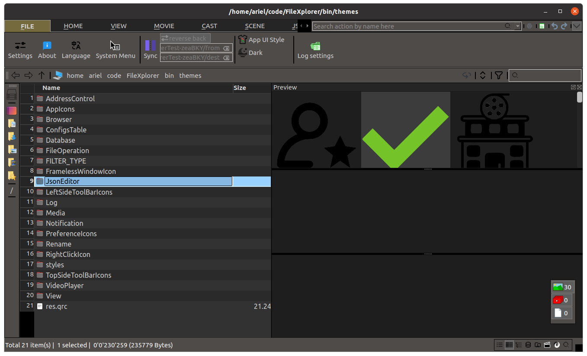
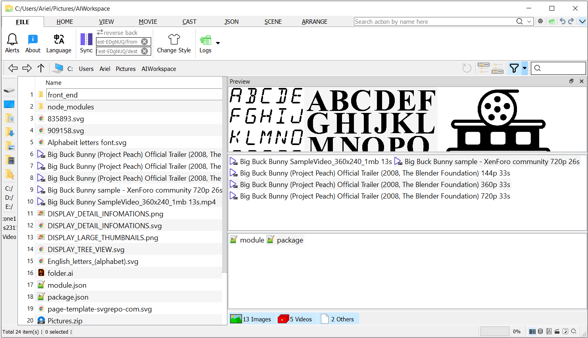
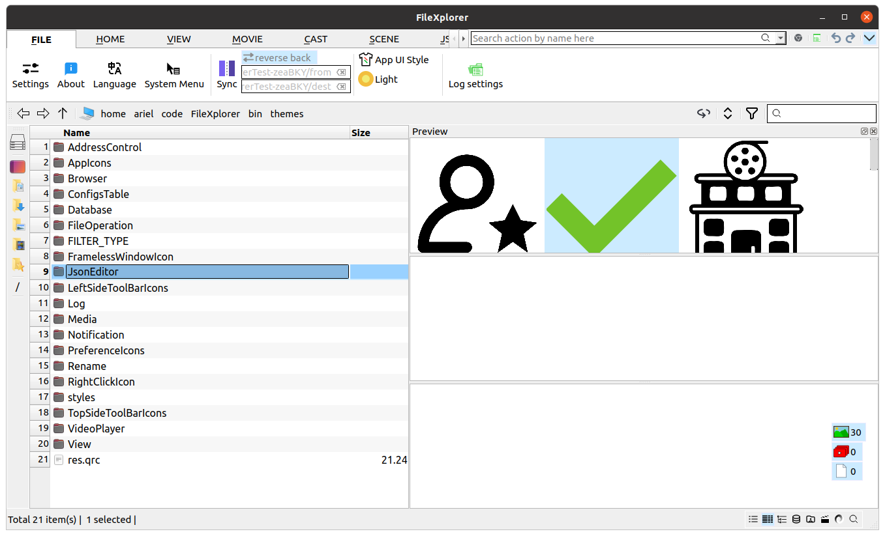
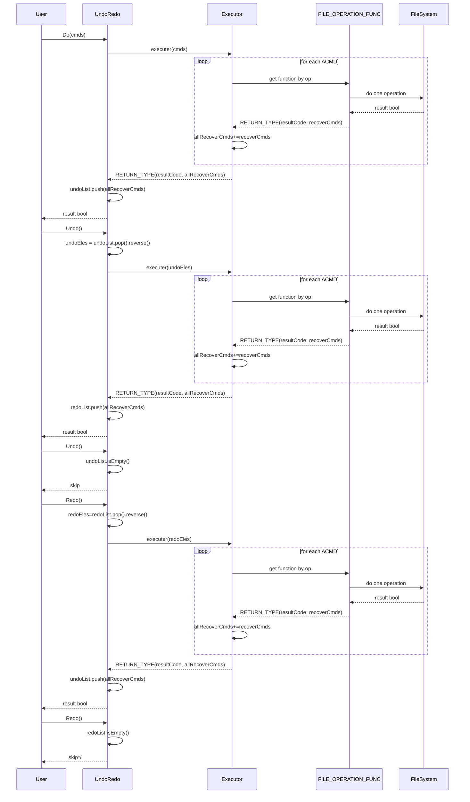

简体中文 | [English](readme.md)


# FileXplorer - Ultimate文件管理套件

## 项目概述
FileXplorer 是一款跨平台专业文件管理系统，专为处理大规模媒体文件的摄影师和摄像师打造，支持在 Windows 和 Linux 环境下进行高级文件操作。




## 开发者环境准备

### 1. FFmpeg/libav（视频时长获取必需）
应用内获取视频时长信息需要 FFmpeg/libav 支持，以下是 Windows 和 Ubuntu 系统的安装配置步骤：

#### Windows 系统
**第一步：下载并解压 FFmpeg**
1. 下载 FFmpeg 动态库包：
   - 访问 FFmpeg 官方下载页：https://ffmpeg.org/download.html
   - 在「Windows EXE Files」区域选择 `Windows builds from gyan.dev`
   - 下载名为 `ffmpeg-7.1.1-full_build-shared.7z` 的压缩包（约 44.4 MiB；兼容的新版本也可使用）
   - 或从https://github.com/CostaHector/FileXplorerInstaller/releases/tag/third_party_dependency下载
2. 将下载的 `.7z` 文件解压到自定义目录（例如 `C:/home/ffmpeg`）

**第二步：验证 FFmpeg 路径配置**
确保包含 `ffmpeg.exe` 的路径（例如 `path=C:/home/ffmpeg/bin`）已添加到用户或系统 `Path` 环境变量中。

**第三步：关闭命令提示符**

#### Ubuntu 系统
通过 apt 安装 FFmpeg 依赖库和二进制文件：
```sh
sudo apt install libavformat-dev libavcodec-dev libavutil-dev libswscale-dev
sudo apt install ffmpeg
ffmpeg -version
```

#### 验证 FFmpeg 集成
运行以下 C++ 代码确认 FFmpeg 配置正确，输出应显示 FFmpeg 版本号（例如 3999588，具体版本可能因构建而异）：
```cpp
#include <QDebug>
extern "C" {
#include <libavformat/avformat.h>
}

void IsFFmpegInstalledOK() {
  avformat_network_init();
  qDebug("FFmpeg version:%u", avformat_version());
}
```

### 2. MediaInfo 库（媒体文件信息获取必需）
获取媒体文件详细元数据需要 MediaInfo 库支持，以下是 Windows 和 Ubuntu 系统的安装步骤：

#### Windows 系统
已预置，无需额外操作。

#### Ubuntu 系统
1. **验证系统架构**
   确保系统为 64 位（amd64/x86_64）兼容：
   `dpkg --print-architecture`
   **预期输出：`"amd64"`**

2. **下载 MediaInfo 包**
   从官方仓库 https://mediaarea.net/en/MediaInfo/Download 下载以下 `.deb` 包：
   例如 Ubuntu 20.04 需要以下 2 个文件：
   - libmediainfo0 v21.09
   - libzen0 v0.4.39

3. **安装包**
   使用 apt 安装下载的包（自动解决依赖）：
   ```sh
   sudo apt install ./libzen0v5_0.4.41-1_amd64.xUbuntu_20.04.deb ./libmediainfo0v5_26.01-1_amd64.xUbuntu_20.04.deb
   ```

4. **验证安装**
   确认库已正确安装并可访问：
   ```sh
   ldconfig -p | grep libmediainfo
   ```
   预期输出显示库路径，例如：
   ```sh
   libmediainfo.so.0 (libc6,x86-64) => /lib/x86_64-linux-gnu/libmediainfo.so.0
   ```

5. **创建符号链接**
   安装会将库放在 `/lib/x86_64-linux-gnu/` 目录，但链接器通常搜索 `/usr/lib/x86_64-linux-gnu/` 目录，创建兼容性符号链接：
   ```sh
   sudo ln -s /lib/x86_64-linux-gnu/libmediainfo.so.0.0.0 /usr/lib/x86_64-linux-gnu/libmediainfo.so
   ls -la /usr/lib/x86_64-linux-gnu/libmediainfo.so
   ```
   应显示符号链接，例如：
   ```sh
   /usr/lib/x86_64-linux-gnu/libmediainfo.so -> /lib/x86_64-linux-gnu/libmediainfo.so.0.0.0
   ```

#### 验证 MediaInfo 集成
安装后，CMake 配置可直接链接 mediainfo：
```cmake
if(WIN32)
    target_link_directories(${PROJECT_NAME} PRIVATE "${CMAKE_CURRENT_SOURCE_DIR}/third_party/mediaInfo/bin")
    target_link_libraries(${PROJECT_NAME} PRIVATE MediaInfo)
elseif(UNIX AND NOT APPLE)
    target_link_libraries(${PROJECT_NAME} PRIVATE dl mediainfo)
endif()
```

验证动态加载是否正常，运行以下测试：
```cpp
#include <QLibrary>
bool testMediaInfo() {
#ifdef _WIN32
    QLibrary mediainfo("MediaInfo.dll");
#else
    QLibrary mediainfo("libmediainfo.so");
#endif
    return mediainfo.load(); // 应返回 true
}
```

### 3. OpenSSL（启用 PASSVAULT 时必需）
密码本功能的加密解密需要 OpenSSL 支持，以下是 Windows 和 Ubuntu 系统的安装步骤：

#### Windows 系统
1. **下载 OpenSSL 安装程序**
   访问官方 Win32/Win64 OpenSSL 下载页：
   https://slproweb.com/products/Win32OpenSSL.html
   - 选择 `Win64 OpenSSL v3.5.1` 包（**非 Light 版本**）
   - 下载安装文件：`Win64OpenSSL-3_5_1.msi`（约 281 MiB）
   - 或从https://github.com/CostaHector/FileXplorerInstaller/releases/tag/third_party_dependency下载

2. **安装 OpenSSL**
   - 运行下载的 `.msi` 安装程序
   - 使用默认安装路径：`C:\Program Files\OpenSSL-Win64`（推荐，便于管理）
   - 安装过程中选择选项：`Copy OpenSSL DLLs to → The OpenSSL binaries (/bin) directory`
   - 按默认设置完成安装向导

3. **验证安装**
   打开命令提示符（CMD）执行以下命令确认安装成功：
   ```cmd
   cd "C:\Program Files\OpenSSL-Win64\bin"
   openssl version
   ```
   确保包含 OpenSSL 的路径已添加到用户或系统 `Path` 环境变量中。

#### Ubuntu 系统
通过终端安装 OpenSSL：
```sh
sudo apt install -y openssl libssl-dev
openssl version
ls /usr/include/openssl/
```

## 核心功能

1. **文件/文件夹预览与侧边栏导航**
   - （1）无需打开文件夹即可分类预览其内容；
   - （2）选中任意文件夹即可在右侧预览面板查看其项目；
   - （3）支持配置文件类型过滤器和自定义默认显示顺序；
   - （4）支持同时拖拽收藏多个文件夹；
   - （5）提供自动（按字母/路径）和手动排序选项；
   - （6）所有书签配置持久保存到本地设置文件；

2. **文件批量重命名操作（带预览窗口）**
   - （1）基础字符串操作（添加/删除/替换），支持正则表达式（例如 `"wifi"` → `"Wi-Fi"`）；
   - （2）大小写转换：大写/小写/标题大小写/句子大小写/交替大小写；
   - （3）按分隔符拆分字符串并重新排序片段（例如 `"Marvel - S01E02 - 2012"` → `"Marvel - 2012 - S01E02"`）；
   - （4）序列编号，支持自定义模式和起始值（例如 `"Trip - Scenery - %d"`，起始值=3）；

3. **多路径同步**
   自动将源文件夹的操作镜像到指定的镜像文件夹；

4. **深度搜索功能**
   支持按文件名、内容或组合条件搜索文件/文件夹；

5. **无障碍访问**
   下拉菜单中模糊匹配操作名称，跳过层级菜单导航；

6. **高级功能**
   - （1）**图片去重**：预览检测到的重复项，删除前手动确认；
   - （2）**视频去重**：比较文件名、大小、时长和部分哈希（前 XX MB）；
   - （3）**一键分类**：将相关图片/视频/文档分组到文件夹，支持撤销；
   - （4）**视频元数据导出**：保存到 MOVIES 表（文件名/大小/时长/MD5），通过 VIDEOS 视图管理；
   - （5）**审计追踪**：文件变更后手动/定时更新 MOVIES 表，记录修改次数；
   - （6）**文件对比**：快速 MD5/大小检查用于身份验证；

7. **UI 主题**
   支持浅色/深色主题，可自动按时间切换或手动锁定；



## 开发设置
```md
git filter-branch --force --index-filter   "git rm --cached --ignore-unmatch AKA_PERFORMERS.txt"   --prune-empty --tag-name-filter cat -- --all  
rm -rf .git/refs/original/
git reflog expire --expire=now --all
git gc --prune=now --aggressive

git remote set-url git@github.com:CostaHector/FileXplorer.git
git remote -v
git remote remove origin
git remote add origin git@github.com:CostaHector/FileXplorer.git
git push -u origin fileXplor:master -f
git remote add origin git@github.com:CostaHector/FileXplorer.git
```

## 新功能
1. **日志控制**

### 日志控制
交互功能：
1. 打开最新日志文件
2. 打开日志文件夹
3. 设置日志级别（默认：error），注意：
   - 此日志级别仅控制发布版本。
4. 日志文件超过 20MiB 时自动老化

日志行示例：
> `hh:mm:ss.zzz E functionName msg [fileName:fileNo]`

## 添加应用到文件系统右键菜单

### Windows 用户
前提：将包含 `[Qt5Core.dll]` 的路径（例如 `"C:\Qt\5.15.2\mingw81_64\bin"`）添加到系统变量 Path 中。

**方法 1：（推荐）**
!resources/AddThisProgramToSystemContextMenu.png
```md
在「文件」标签页控件中；
点击「系统菜单/添加」；
在弹出的 UAC 窗口中点击允许此应用进行更改；
```

**方法 2：**
```md
打开注册表编辑器（regedit）；
进入路径 `Computer\HKEY_CLASSES_ROOT\Directory\Background\shell\`；
在「shell」下新建键「FileXplorer」；
在「FileXplorer」下新建键「command」；
修改「command」的（默认）值为以下字符串：
`"C:\home\aria\code\FileXplorer\build\Desktop_Qt_5_15_2_MinGW_64_bit-Release\FileXplorer.exe" "%V"`
```

### Ubuntu 用户
使用 fma-config-tool：
```sh
sudo apt install nautilus-actions
fma-config-tool
```
在菜单栏「FileManager Action Configuration Tool」中，取消勾选以下操作：
> 首选项 > 运行时首选项 > Nautilus 菜单布局 > 创建根目录「FileManager-Actions」菜单

定义新操作：
1. 设置「操作」标签页如下：
   - 勾选在选择上下文菜单中显示该操作；
   - 勾选在位置上下文菜单中显示该操作；
   - 图标：`/home/ariel/code/FileXplorer/resources/themes/AppIcons/FOLDER_OF_PICTURES.png`
2. 设置「命令」标签页如下：
   - 路径：`/home/ariel/code/FileXplorer/build/Desktop_Qt_5_15_2_GCC_64bit-Release/FileXplorer`
   - 参数：`"%d"`

保存项目树。

## Linux 覆盖率报告
```bash
cmake --build /home/ariel/code/FileXplorer/build/FileXplorerTest_Desktop_Qt_5_15_2_GCC_64bit-Debug --target all
cd /home/ariel/code/FileXplorer/build/FileXplorerTest_Desktop_Qt_5_15_2_GCC_64bit-Debug;/usr/bin/lcov --capture --directory . --output-file coverage.info --exclude "/home/ariel/Qt/*" --exclude "/usr/include/*" --exclude "/usr/local/include/*" --exclude "*/TestCase/*" --exclude "*/unittest/*" --exclude "*/build/*"
cd /home/ariel/code/FileXplorer/build/FileXplorerTest_Desktop_Qt_5_15_2_GCC_64bit-Debug;genhtml coverage.info --output-directory coverage_report
cd /home/ariel/code/FileXplorer

# 如果某些文件已被移除，删除相关文件如 {*.gcda, *.gcno, *.o, *.html}
find ./ -name "RemovedFileName*" -print
find ./ -name "RemovedFileName*" -delete
```

## 更新翻译文件（如需）
```bash
cd 项目路径
# Windows 系统
C:/Qt/5.15.2/mingw81_64/bin/lupdate . -no-obsolete -recursive -locations relative -ts ./resources/Translate/FileXplorer_zh_CN.ts
C:/Qt/5.15.2/mingw81_64/bin/linguist ./resources/Translate/FileXplorer_zh_CN.ts
C:/Qt/5.15.2/mingw81_64/bin/lrelease ./resources/Translate/FileXplorer_zh_CN.ts -qm ./resources/Translate/FileXplorer_zh_CN.qm
# Linux 系统
/home/ariel/Qt/5.15.2/gcc_64/bin/lupdate . -no-obsolete -recursive -locations relative -ts ./resources/Translate/FileXplorer_zh_CN.ts
/home/ariel/Qt/5.15.2/gcc_64/bin/linguist ./resources/Translate/FileXplorer_zh_CN.ts
/home/ariel/Qt/5.15.2/gcc_64/bin/lrelease ./resources/Translate/FileXplorer_zh_CN.ts -qm ./resources/Translate/FileXplorer_zh_CN.qm
```

## 字体类型与大小
从 `C:\Windows\Fonts` 复制文件 `"msyh.ttc"` `"msyhbd.ttc"`：
```bash
sudo mkdir -p /usr/share/fonts/microsoft
sudo cp msyh.ttc msyhbd.ttc /usr/share/fonts/microsoft/
sudo fc-cache -fv
```

## 推荐 SQLite 数据库浏览器
```sh
sudo apt update
sudo apt install sqlitebrowser
```

## Snippets
Edir/Preference/TextEditor/Snippets
Add and fill contents below

`Trigger`: StdTestCase

`Trigger Variant`: widget

```cpp
#include <QtTest/QtTest>
#include "PlainTestSuite.h"
#include "OnScopeExit.h"
#include <QTestEventList>
#include <QSignalSpy>

#include "Logger.h"
#include "MemoryKey.h"
#include "Configuration.h"
#include "BeginToExposePrivateMember.h"
#include "$ClassName$.h"
#include "EndToExposePrivateMember.h"

#include <QDir>
#include <QDirIterator>

Q_DECLARE_METATYPE(QDir::Filters)
Q_DECLARE_METATYPE(QDirIterator::IteratorFlag)

class $ClassName$Test : public PlainTestSuite {
  Q_OBJECT
 public:
 private slots:
  void initTestCase() {
    qRegisterMetaType<QDir::Filters>("QDir::Filters");
    qRegisterMetaType<QDirIterator::IteratorFlag>("QDirIterator::IteratorFlag");
    Configuration().clear();
  }

  void cleanupTestCase() { Configuration().clear(); }

  void test_1() {
    $$
  }
};

#include "$ClassName$Test.moc"
REGISTER_TEST($ClassName$Test, false)
```


## Testcase
### Table 1.0 Expected Behavior of rename Functions
```cpp
RETURN_TYPE rename(const QString& srcPath, const QString& oldCompleteName, const QString& newCompleteName);
```
| srcPath | oldCompleteName | newCompleteName | exist items in srcPath | result |
|---------|-----------------|-----------------|---------------------------------------------------|--------|
| home | a | A | {a} | OK |
| home | a | A | {a, A} | In windows platform no need consider this one as system may prevent two items(Only differ in case) place/create/moved in one folder;<br/>Linux return DST_FILE_OR_PATH_ALREADY_EXIST |
| home | a | a | {a} | SKIP |
| home | a | b | {a} | OK |
| home | a | b | {a,b} | windows/linux return DST_FILE_OR_PATH_ALREADY_EXIST|
| home | a | B | {a,B} | windows/linux return DST_FILE_OR_PATH_ALREADY_EXIST|
| home | a | b | {a,B} | windows return DST_FILE_OR_PATH_ALREADY_EXIST;<br/>Linux return OK|
| home | a | B | {a,b} | windows return DST_FILE_OR_PATH_ALREADY_EXIST;<br/>Linux return OK|

### Table 1.1 Expected Behavior of mv Functions
```cpp
RETURN_TYPE mv(const QString& srcPath, const QString& relToItem, const QString& dstPath);
```
| srcPath | relToItem | dstPath | exist items in dstPath | result |
|---------|-----------|---------|---------------------------------------------------|--------|
| home | any1 | home | {any1} | OK, SKIP |
| home | any1 | HOME | {any1} | OK, SKIP. It is not recommend to create two folder only differ in name case in Linux platform. |
| home | a | bin | {} | OK |
| home | a | bin | {a} | windows/linux return DST_FILE_OR_PATH_ALREADY_EXIST |
| home | a | bin | {A} | windows return DST_FILE_OR_PATH_ALREADY_EXIST;<br/>linux return OK |
| home | path/to/a | bin | {} | OK |
| home | path/to/a | bin | {path/to} | OK |
| home | path/to/a | bin | {path/to/a} | windows/linux return DST_FILE_OR_PATH_ALREADY_EXIST |
| home | path/to/a.txt | bin | {} | OK |

### Table 1.2 Expected Behavior of rmpath Functions
```cpp
RETURN_TYPE rmpath(const QString& pre, const QString& dirPath);
```
| srcPath | relToItem | exist items in srcPath | result |
|---------|-----------|---------------------------------------------------|--------|
| home | a/a1 | {a/a1, a/a1/a2.txt} | CANNOT_REMOVE_DIR |
| home | a/a1 | {a/a1} | OK |
| home | a | {a/a.txt} | CANNOT_REMOVE_DIR |
| home | a | {a} | OK |

### Table 1.3 Expected Behavior of mkpath Functions
```cpp
RETURN_TYPE mkpath(const QString& pre, const QString& dirPath);
```
| srcPath | relToItem | exist items in srcPath | result |
|---------|-----------|---------------------------------------------------|--------|
| home | a/a1 | srcPath not exist | DST_DIR_INEXIST |
| home | a/a1 | {} | OK |
| home | a/a1 | {a} | OK |
| home | a/a1 | {a/a1} | OK |
| home | a | {} | OK |

### Table 1.4 Expected Behavior of RedundantImageFinder class
| imgs in benchmarkPath<br/>name(contents) | imgs in pathToFindRedundent<br/>name(contents) | also find empty  | result |
|---------|-----------|---------------------------------------------------|--------|
| {a.jpg("123"),<br/>aDuplicate.png("123"),<br/>b.png("456")} | {aRedun.jpg("123"),<br/>bRedun.png("456"),<br/>cEmpty.webp("")} | true | {aRedun.jpg,<br/>bRedun.png,<br/>cEmpty.webp} |
| {a.jpg("123"),<br/>aDuplicate.png("123"),<br/>b.png("456")} | {aRedun.jpg("123"),<br/>bRedun.png("456"),<br/>cEmpty.webp("")} | false | {aRedun.jpg,<br/>bRedun.png} |


### Table 1.5 Expected Behavior of function FileOperation::executer
```cpp
RETURN_TYPE executer(const BATCH_COMMAND_LIST_TYPE& aBatch);
```

| `QList<ACMD>` | precondition | `bFastFail` | `ErrorCode` | `AllRecoverCmds` |
|-------------|--------------|-----------|--------|-------|
|ACMD[RNAME,home,filea,fileb];<br/>ACMD[RNAME,home,fileb,filec];| exists:  {home/filea} | not matter | OK | ACMD[RNAME,home,fileb,filea];<br/>ACMD[RNAME,home,filec,fileb];|
|ACMD[RNAME,home,filea,nfilea];<br/>ACMD[RNAME,home,fileb,nfileb];| exists:  {home/fileb} | true | SRC_INEXIST | empty|
|ACMD[RNAME,home,filea,nfilea];<br/>ACMD[RNAME,home,fileb,nfileb];| exists:  {home/fileb} | true | EXEC_PARTIAL_FAILED | ACMD[RNAME,home,nfileb,fileb];|


### Undo/Redo/Executor Sequence Diagram



### Table 1.6 Notificator Balloon Function Test Results

| Function Point | Test Case | Test Result |
|----------------|-----------|-------------|
| One-shot timer timeout triggers close | `timeoutLenGT0_AutoHideTimerActive_ok` | ✅ PASS |
| Progress bar completion triggers close | `progress100_drive_FreeMe_ok` | ✅ PASS |
| Finished signal triggers close | `finished_signal_drive_FreeMe_ok` | ✅ PASS |
| Multiple notifications layout from top to bottom (with Y-coordinate wrapping) | `cards_tile_from_top_to_bottom_wrapped_ok` | ✅ PASS |
| Multiple notifications layout from bottom to top (with Y-coordinate wrapping) | `cards_tile_from_bottom_to_top_wrapped_ok` | ✅ PASS |

## Third-Party Licenses & Acknowledgments

The database-related icons used in this application are sourced from the [DB Browser for SQLite](https://github.com/sqlitebrowser/sqlitebrowser) project. These icons are licensed under the [GNU General Public License v3](https://www.gnu.org/licenses/gpl-3.0.html) (GPLv3).

This project incorporates the following open-source software:

* **[Qt](https://www.qt.io/)** (Licensed under LGPL v3) - Used under the terms of the LGPL v3. Qt is a product of The Qt Company.
* **[FFmpeg](https://ffmpeg.org/)** (Licensed under LGPL v2.1/v3) - Used under the terms of the LGPL. FFmpeg is a trademark of Fabrice Bellard, et al.
* **[OpenSSL](https://www.openssl.org/)** (Licensed under Apache License 2.0) - Used under the terms of the Apache License 2.0.
* **[MediaInfo](https://mediaarea.net/en/MediaInfo)** (Licensed under Simplified BSD License) - Used under the terms of the Simplified BSD License.

This software is licensed under the [GNU General Public License v3.0](LICENSE). 
(If you chose MIT, change this line to: *This software is licensed under the [MIT License](LICENSE).*)
